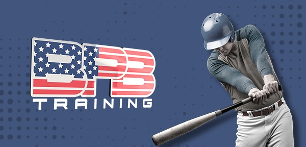
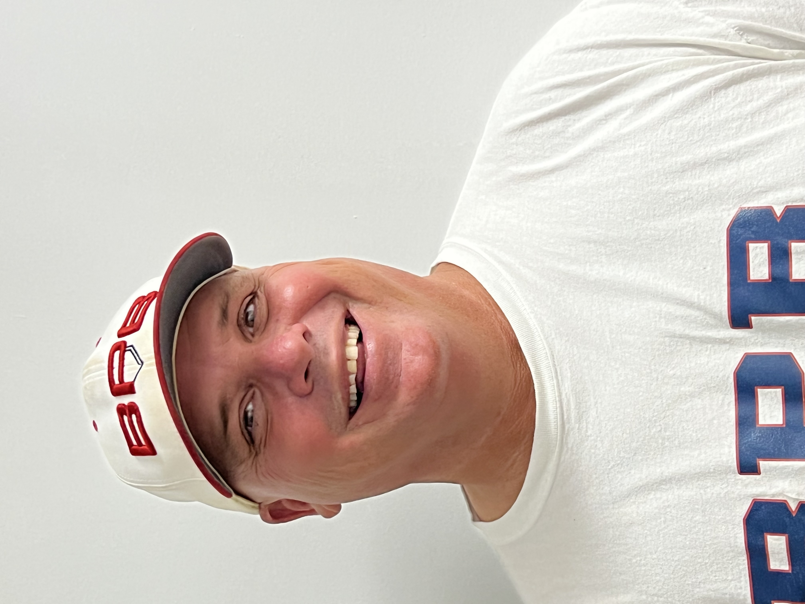
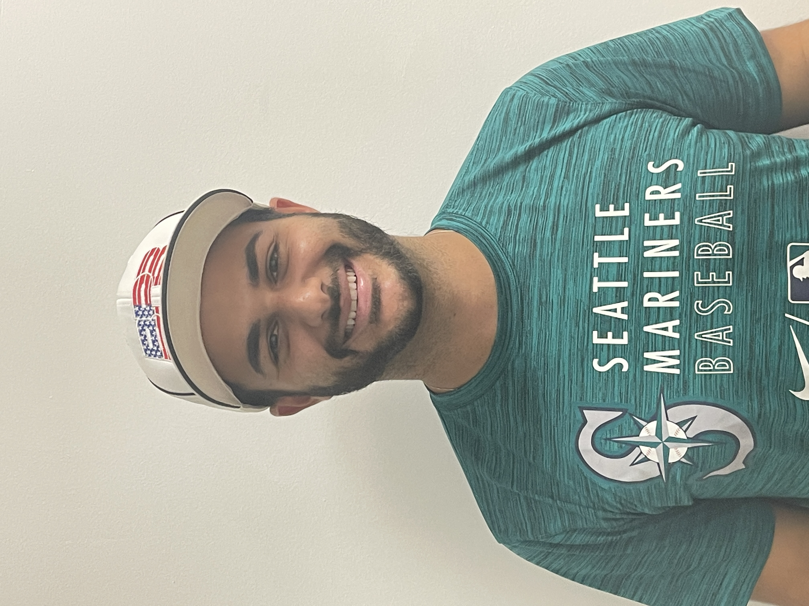
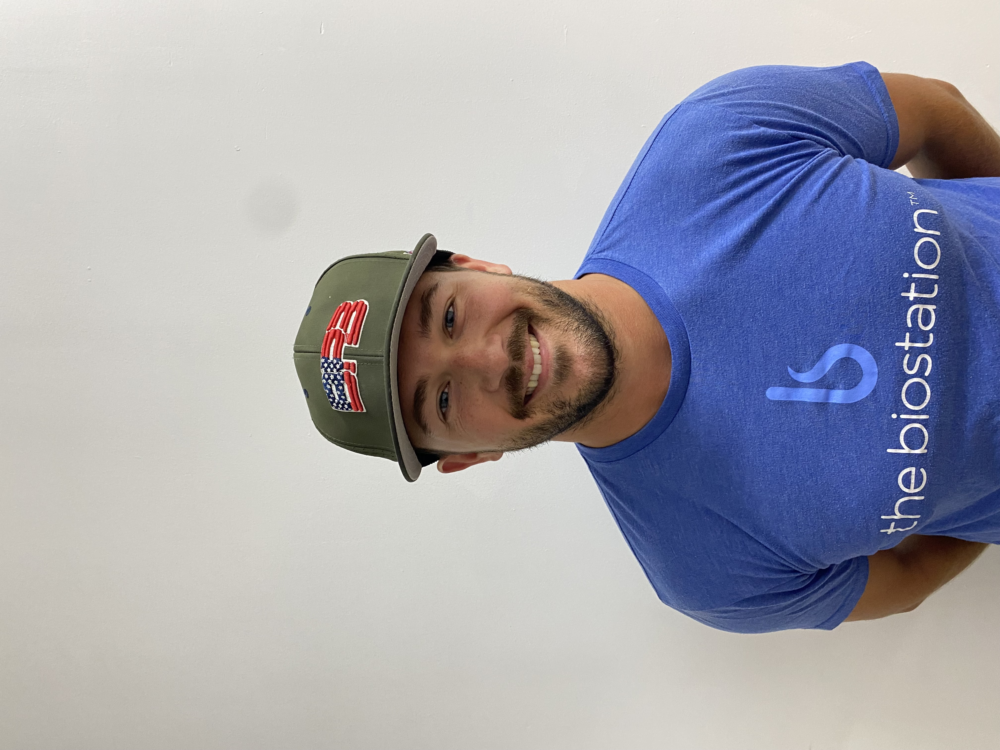
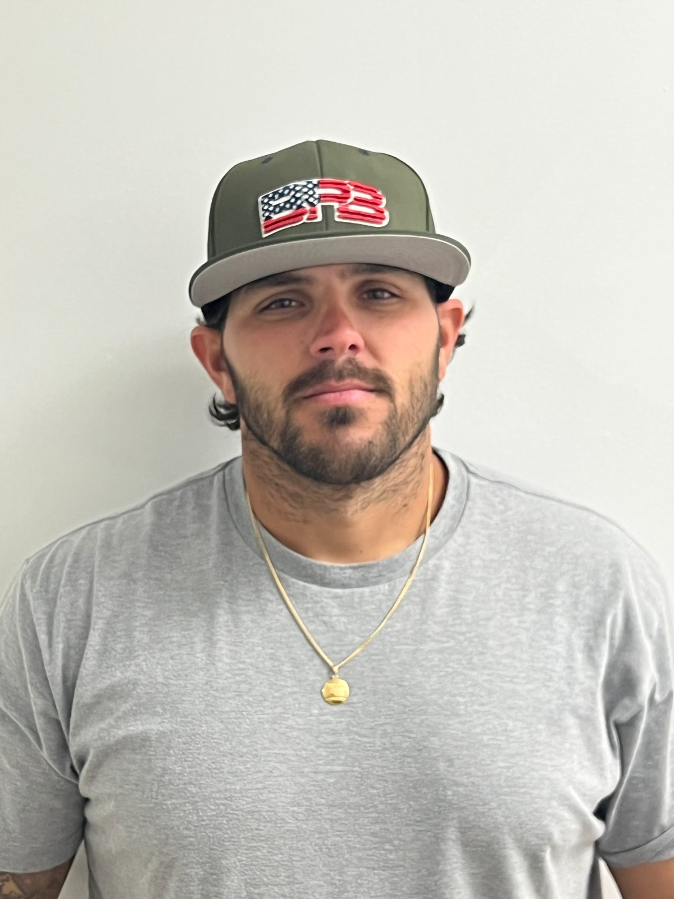
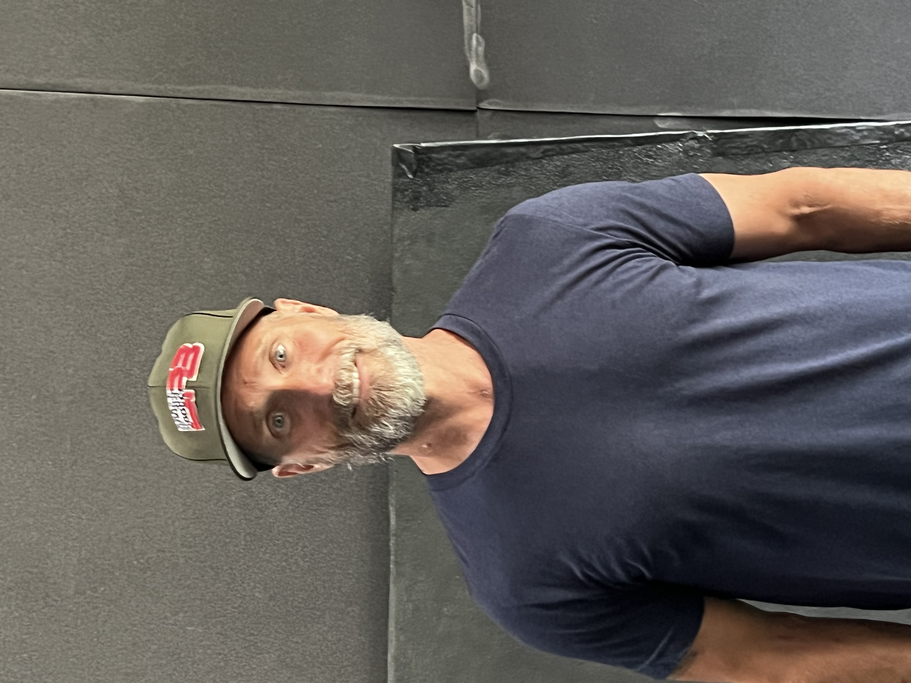
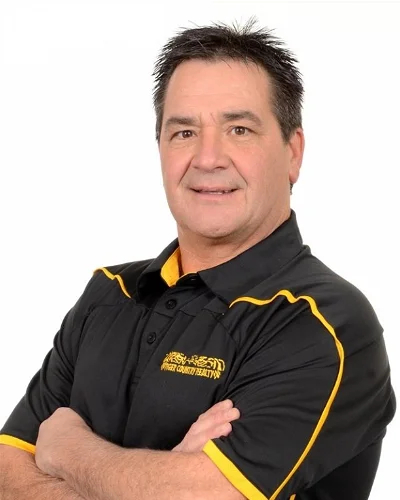
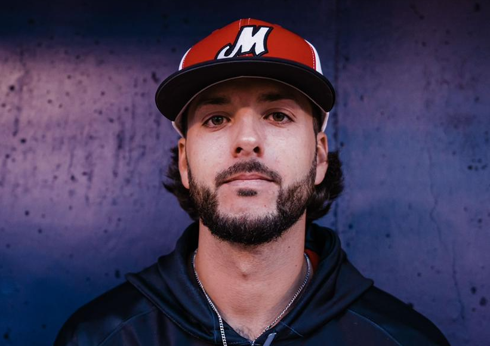

<!DOCTYPE html>
<html lang="en">
<head>
    <meta charset="UTF-8">
    <meta http-equiv="X-UA-Compatible" content="IE=edge">
    <meta name="viewport" content="width=device-width, initial-scale=1.0">
    <link rel="stylesheet" href="index.css">
    <title>BPB Training</title>
</head>
<body>
    

        
    

    

        

            

                <h1>The best coaches</h1>
                
Whether you are looking to improve a technique or skill, seek agility or speed, we have the ideal Coach for you. Meet them, and find the one that best suits your current needs.

                <a href="#" class="button button-white">Book a lesson</a>
                <a href="#" class="button button-blue">meet our coaches</a>
            

        

        

            
            
            
        

        

            

                

                    

                        

                            
                        

                        <h2>Brad Pennington</h2>
                        
Brad Pennington is a former Major League Pitcher. He was the 12th pick by the Baltimore Orioles in the June 1989 draft. Brad made his MLB debut in 1993 and played 5 seasons in the Major Leagues with the Orioles

                    

                

                

                    

                        

                            
                        

                        <h2>Tal Erel</h2>
                        
Tao Erel is an Israeli National Baseball Team member and certified baseball instructor. Competed in the 2020 Tokyo Olympics as well as played professionally in the Netherlands and Czech Republic. Tao is also going to be a guest catching instructor for the Cleveland Guardians this fall. Currently an MBA student at Lynn University. Tao excels at Catching and Hitting and Bigger/Faster/Stronger Programs

                    

                

                

                    

                        

                            
                        

                        <h2>Brian Mayer</h2>
                        
Brian Mayer is a catching and hitting coach who has years of experience with players at all levels. Brian played for the Lancaster Barnstormers and New Britain Bees of the Atlantic League in 2019 as well 4 other teams between 2017 and 2018. In 2020 Brian was the bullpen catcher for the USA Olympic Baseball Team that earned a silver medal at the 2020 Tokyo Olympics. Brian has also been the private catcher for Justin Verlander, Max Scherzer, Noah Syndergaard, Brad Hand, Chi Chi Gonzalez, and Jesus Lezardo to name a few of the MLB pitchers he has caught. Brian still educates himself on all the new technologies and techniques and works hard to pass on all the information he has gained over his career.

                    

                

                

                    

                        

                            
                        

                        <h2>Chris Farrell</h2>
                        
Chris played baseball at Broward College and Palm Beach Atlantic. While at PBA Chis earned All-Region selection for his play at 3rd base. Chris was also named to the ABCA/Rawlings All-South Region team. In 2015 Chis was named the Palm Beach Atlantic Male Athlete of the year! After finishing his collegiate career Chris has remained very active in youth baseball in the area, doing many private lessons and coaching several travel teams. Chris specializes in Hitting and Infield.

                    

                

                

                    

                        

                            
                        

                        <h2>Ed Yacopino</h2>
                        
Ed brings a lot of experience to the facility. After signing out of Louisiana-Lafayette, Ed played 8 years in professional baseball making it as high as AAA with 3 teams, the Baltimore Orioles, Milwaukee Brewers, and the Pittsburgh Pirates. He also played winter ball in the Dominican Republic, Venezuela, and Mexico. When his career was over he has helped youth baseball players in private lessons and coaching travel teams. Ed was a switch hitter, and an outstanding outfielder during his professional career, and excels in these areas.

                    

                

                

                    

                        

                            
                        

                        <h2>Marc Truit</h2>
                        
Marc has been playing baseball his whole life and has trained under Brad Pennington for 5 years. Marc has played baseball in Puerto Rico in the PRIBL for the last 2 years straight out of high school (West Boca). When not playing Marc always helps coach West Boca Panthers travel teams and helps West Boca High with Pitching. He love teaching the game to younger kids from a younger perspective, also to see the competition behind him.

                    

                

                

                    

                        

                            
                        

                        <h2>Luke Kelley</h2>
                        
Luke Kelley born and raised in Wake Forest, NC grew up playing baseball. His first achievement with baseball was conference pitcher of the year at South Granville High School. This is when he knew baseball was his passion. He then went on to being nationally ranked at Surry college in 2012. While being looked at by many MLB teams, Luke tore his meniscus and was quick to find out the importance of health, injury prevention, and recovery. His knowledge has helped develop himself and athletes of all ages

                    

                

            

        

        

            
            
        

    

    
</body>
</html>